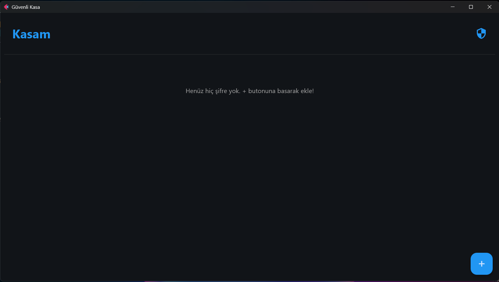

# 🔒 PassMAnager - Local Password Manager


**Secure Vault** is a modern, secure, and offline password manager desktop application built with Python and Flet. It uses strong industry-standard encryption to keep your credentials safe locally on your machine.



## ✨ Features

* **🛡️ High Security:** Uses **PBKDF2** for master password hashing and **Fernet (AES)** for data encryption.
* **🎨 Modern UI:** Clean and responsive interface built with Google's **Flet** framework (Dark Mode enabled).
* **📂 Local Storage:** Data is stored in a local SQLite database (`passwords.db`). No cloud uploads.
* **⚡ CRUD Operations:** Easily Add, View, Update, and Delete password entries.
* **📋 Clipboard Integration:** Copy passwords to clipboard with a single click.
* **🔐 Master Key Protection:** The database is inaccessible without the correct master password.

## 🛠️ Tech Stack

* **Language:** Python
* **GUI Framework:** [Flet](https://flet.dev/) (Flutter based)
* **Database:** SQLite3
* **Cryptography:** `cryptography` library (Fernet, PBKDF2HMAC, SHA256)

## 🚀 Getting Started

### Prerequisites

* Python 3.x installed on your system.

### Installation

1.  **Clone the repository**
    ```bash
    git clone https://github.com/oguzhantimur4444/PassManager.git
    cd PassManager
    ```

2.  **Create a Virtual Environment (Optional but recommended)**
    ```bash
    python -m venv venv
    # Windows
    venv\Scripts\activate
    # Mac/Linux
    source venv/bin/activate
    ```

3.  **Install Dependencies**
    ```bash
    pip install flet cryptography
    ```

4.  **Run the Application**
    ```bash
    python main.py
    ```

## 🔒 Security Details

The application prioritizes security using the following mechanism:

1.  **Salt & Hash:** When creating the master user, a random 16-byte salt is generated. The password is hashed using **PBKDF2HMAC** (SHA256, 100,000 iterations).
2.  **Encryption Key:** A 32-byte URL-safe base64-encoded key is derived from the master password to encrypt/decrypt user data.
3.  **Data Protection:** Usernames, passwords, and website URLs are all encrypted before being stored in the database.

## 🤝 Contributing

Contributions are welcome! Please feel free to submit a Pull Request.

1.  Fork the project
2.  Create your feature branch (`git checkout -b feature/AmazingFeature`)
3.  Commit your changes (`git commit -m 'Add some AmazingFeature'`)
4.  Push to the branch (`git push origin feature/AmazingFeature`)
5.  Open a Pull Request

## 📝 License

This project is licensed under the MIT License.

---
**Developed with ❤️ by Oguzhan Timur**
